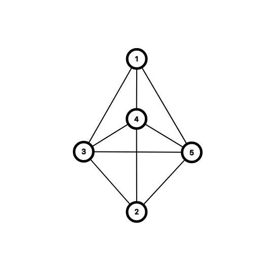

# Algorithms

When you have no life other than solving these on weekends.

## Travelling salesman problem (TSP)

```txt
| C | O | O | C |
| O | S | O | O |
| O | O | O | H |
| C | O | O | O |
```

Finding the optimal path (minimum distance) a Salesman (S) has to travel between multiple cities (C) in a grid before getting home (H).

Solved using dynamic programming approach where a solution is guranteed.
The python code should be able to solve for any grid size, for any number of cities.

The names are mapped to integer values for keeping the solution general to any such problem.

The problem can be represented as an undirected weighted graph since every city is connected to every other city where the cities can be represented as nodes of the graph and the distances between them as the weights.

### Graph key

`S = 1`

`H = 2`

`Cities (C) = 3,4,5`



The solution can then be formulated as below.

<!-- \\S = 1 \\
H = 2 \\
C = \{\ 2+i:i\epsilon\mathbb{N} \}  \\
L_{M,N} = Cost(M,N) \\
g(S, [C]) = min \{\ L_{S,C_i} + g(C_i , [C]-[C_i]): i\epsilon\mathbb{N} \} \\
g(C_N, H) = L_{C_N,H} -->


